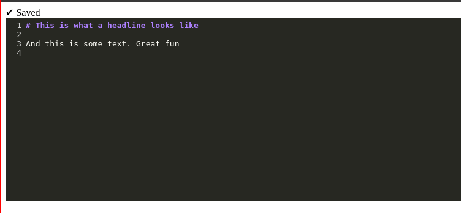

# Simple example of how to use CodeMirror as a custom element in Elm

Mostly taken from: https://www.youtube.com/watch?v=tyFe9Pw6TVE

## Try it

```shell
npm install
elm make src/Main.elm --output main.js --debug
# stack install wai-app-static # To get the warp server
warp # Or serve it in your preferred way
```

Should look like this


## What it does

- Created `code-mirror` tag using javascript
- Fires events when the editor content changes
- Creates editor from Elm
- Fake saves every 5 seconds

